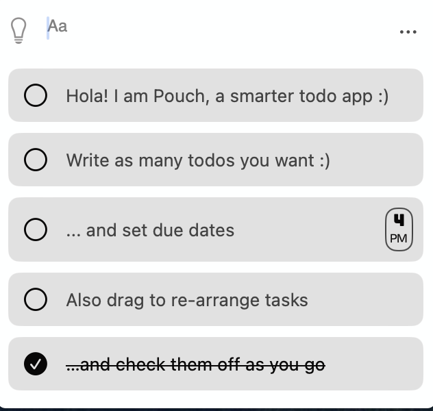
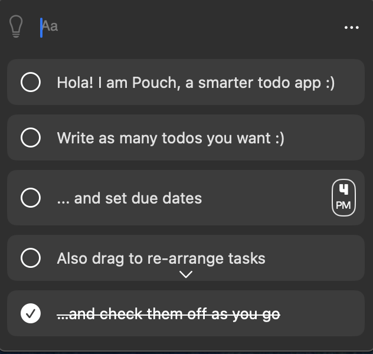
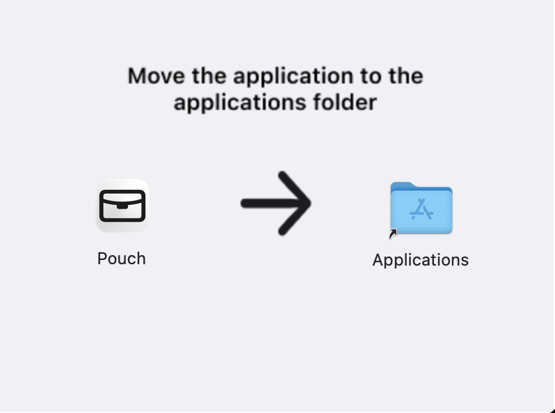

# Pouch

The Pouch is a small menubar for Mac  that helps you track your To-Do tasks and manage your day.

 

## Requirements
Minimum macOS version 13.0.0 (Ventura)

## Installation

1. Download dmg file from [the release page](https://github.com/bansd/Pouch/releases).

2. Double click to open and drag the app to Applications folder.
  

## How does it work?
Pouch is a minimalistic and simple to-do app. Manage your daily todos straight from your menu bar.

All your data is stored locally. 

## Features
Stay Tuned! We are currently updating this space.
